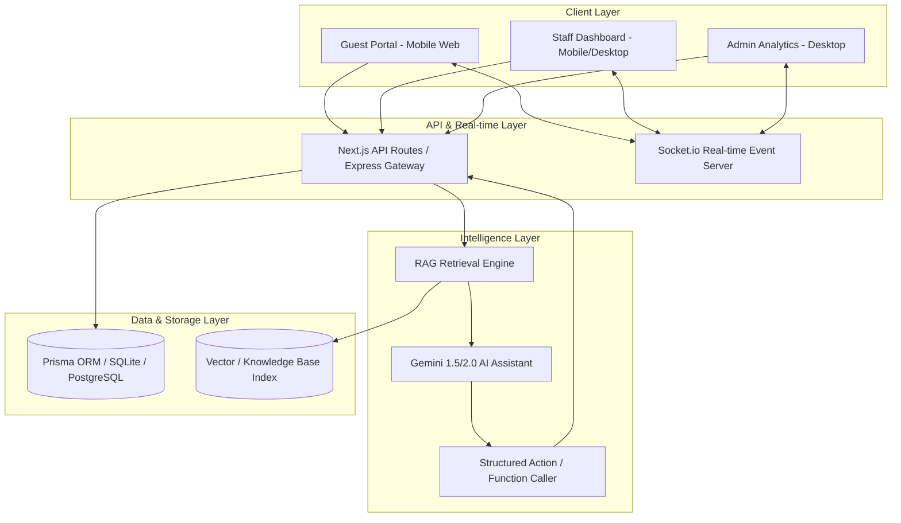
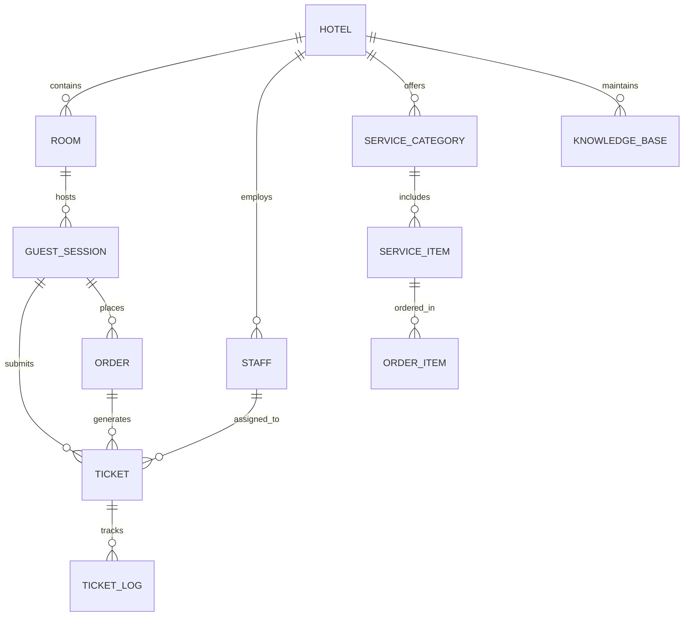

# SmartStay Architecture & UX Specification

## 1. Executive Overview

**SmartStay** is an AI-native Hotel Concierge and Service Automation platform. It bridges the gap between hotel guests, operational staff, and hotel management through real-time ticket automation, conversational AI RAG, and live operational analytics.

---

## 2. High-Level System Architecture

---

## 3. Data Domain Model & Schema Specifications

### Key Entities:
1. **Hotel**: Multi-tenant root (Name, address, contact, settings, logo, checkout time, Wi-Fi details).
2. **Room**: Room number, floor, room type (Deluxe, Suite, Standard), status (Occupied, Vacant, Cleaning).
3. **GuestSession**: Active guest check-in session (Guest name, room ID, check-in date, check-out date, session PIN/token, status).
4. **Staff**: Hotel staff profile (Name, email, role, department: `HOUSEKEEPING`, `MAINTENANCE`, `KITCHEN`, `FRONT_DESK`, `MANAGEMENT`).
5. **Ticket (Service Request)**: Core automation unit (Title, description, category, department, priority: `LOW`/`MEDIUM`/`HIGH`/`URGENT`, status: `PENDING`/`ASSIGNED`/`IN_PROGRESS`/`COMPLETED`/`CANCELLED`, room ID, assigned staff ID, SLA target time, SLA state).
6. **Order & OrderItem**: Digital room service orders linked to F&B kitchen tickets.
7. **KnowledgeBaseItem**: Q&A pairs, hotel policy documents, local guide info, amenity details used for AI Concierge RAG.
8. **TicketLog**: Audit log for status changes, escalations, staff comments, and timing metrics.

---

## 4. Role-Based Access Control (RBAC) Matrix

| Feature / Module | Guest | Staff (Housekeeping) | Staff (Maintenance) | Staff (Kitchen) | Front Desk | Hotel Admin |
| :--- | :---: | :---: | :---: | :---: | :---: | :---: |
| Access Guest Portal | ✅ | ❌ | ❌ | ❌ | ❌ | ❌ |
| Chat with AI Concierge | ✅ | ❌ | ❌ | ❌ | ❌ | ❌ |
| Submit Room Service / Requests | ✅ | ❌ | ❌ | ❌ | ❌ | ❌ |
| View Assigned Dept Tickets | ❌ | ✅ | ✅ | ✅ | ✅ | ✅ |
| Change Ticket Status | ❌ | ✅ (Housekeeping) | ✅ (Maintenance) | ✅ (Kitchen) | ✅ (All) | ✅ |
| Reassign / Escalate Ticket | ❌ | ❌ | ❌ | ❌ | ✅ | ✅ |
| Manage KB / Menu / Amenities | ❌ | ❌ | ❌ | ❌ | ❌ | ✅ |
| View Analytics & SLA Metrics | ❌ | ❌ | ❌ | ❌ | ❌ | ✅ |

---

## 5. UX Layout Wireframes & Design System

### Design System Tokens
- **Brand Colors**:
  - Primary (Emerald Luxury): `#0F5132` (Dark Green), `#198754` (Accent Green)
  - Dark Slate Neutral: `#0F172A` (Background headers/dark mode)
  - Gold Accent: `#D97706` (VIP / Premium highlighting)
  - Status Indicators:
    - Pending: `#F59E0B` (Amber)
    - In Progress: `#3B82F6` (Blue)
    - Completed: `#10B981` (Green)
    - Urgent SLA: `#EF4444` (Red pulse)
- **Typography**: Inter / Plus Jakarta Sans (Clean, legible, modern UI).

### User Portals UX Flow

#### A. Guest Portal UI (`/guest`)
- **Header**: Room number, Hotel Branding, Guest welcome message.
- **Top Quick Actions**:
  - 🤖 AI Assistant ("Ask Concierge")
  - 🛎️ Request Towels / Amenities
  - 🧹 Request Room Cleaning
  - 🍔 Room Service Menu
  - 🛠️ Maintenance / Repair
- **Live Status Widget**: Active requests card showing real-time step progress (Submitted -> Assigned -> On the way -> Completed).
- **Interactive Chat Widget**: Floating button opening voice/text AI concierge drawer.

#### B. Staff Workspace UI (`/staff`)
- **Header**: Department toggle (`Housekeeping` | `Maintenance` | `Kitchen` | `Front Desk`), Duty status (`On Duty` / `Off Duty`).
- **Live SLA Metric Bar**: Active open tickets count, average response time today, urgent warnings.
- **Kanban Board / Task List**:
  - Columns: **Incoming (Unassigned)**, **In Progress**, **Completed**.
  - Ticket Card: Room #, Request Title, Time elapsed, Priority badge, Quick Action buttons ("Accept", "Complete", "Reassign").

#### C. Admin & Analytics Dashboard (`/admin`)
- **Sidebar**: Overview, Active Live Operations, Knowledge Base & Menu Editor, Staff Performance, SLA Analytics, Settings.
- **Metrics Grid**: Total requests today, AI Auto-resolution %, Avg SLA resolution time, Top requested services.
- **Live Heatmap / Chart**: Request volume by hour & department.
- **RAG Knowledge Base Manager**: Add/edit hotel FAQs, policies, Wi-Fi info, local guide entries with instant preview test.

---

## 6. Real-time Event System (Socket.io)

### Key Event Definitions:
- `ticket:created`: Broadcasted to department staff channel & admin when guest or AI creates a ticket.
- `ticket:updated`: Broadcasted when staff updates status (e.g. `IN_PROGRESS`, `COMPLETED`), notifying the guest's live status widget.
- `ticket:escalated`: Triggered when SLA target is exceeded, highlighting ticket in red on Front Desk & Admin views.
- `ai:action_triggered`: Broadcasted when AI Concierge parses a natural language request and generates a structured ticket.

---

## 7. Next Steps: Proceeding to Phase 2 (Database + Backend)
With Phase 1 Architecture & UX specification defined, Phase 2 will implement:
1. `package.json` and dependency setup.
2. `prisma/schema.prisma` with all models & SQLite configuration.
3. Database seeding script (`prisma/seed.ts`).
4. Express / API backend & WebSocket event setup.
